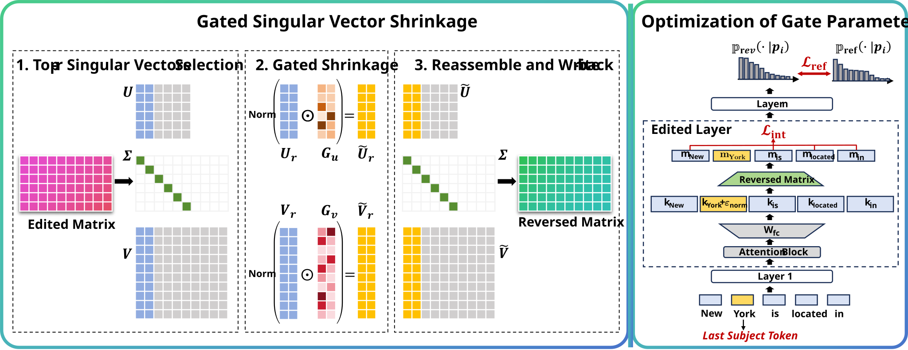

# Spectral Reverse

This repository contains the implementation of our paper, [***Selective Knowledge Edit Reversal via Gated Singular Vector Shrinkage***](https://arxiv.org/abs/2609.02091).

## Overview

We study **selective reversal of edited knowledge**, where the goal is to reverse a targeted subset of edited facts while preserving the remaining edits in the model.

We propose a spectral reversal framework that locates edit-sensitive components within the dominant singular subspace of edited weights and selectively suppresses them through **gated singular vector shrinkage**.

Experiments across multiple models, editing methods, and datasets demonstrate that our method can effectively reverse selected edits while largely preserving the remaining edited knowledge. Our results also provide empirical evidence that different edits can be sparsely encoded within dominant singular components and remain separable when the number of edits is moderate.

<p align="center">
  
</p>

## Environment

Our implementation is based on **Python 3.9.7**.

Install the required dependencies with:

```bash
pip install -r requirements.txt
```

## Data

All datasets used in our experiments are provided in the [`./data`](./data) directory.

## Usage

The main entry point for selective knowledge edit reversal is:

```bash
python main_spectral_reverse.py \
    --editing_method $editing_method \
    --model_name $model_name \
    --data_type $data_type \
    --ds_size $ds_size \
    --lamHyper $lamHyper \
    --num_edits $num_edits \
    --sequential_edit \
    --save_model \
    --do_eval \
    --eval_topk $eval_topk \
    --seed $seed \
    --spectral_gate_lr $spectral_gate_lr \
    --spectral_gate_lambda_dh $spectral_gate_lambda_dh \
    --spectral_gate_rank $spectral_gate_rank \
    --spectral_gate_lambda_kl_ref $spectral_gate_lambda_kl_ref \
    --spectral_gate_ref_prefix $spectral_gate_ref_prefix \
    --spectral_gate_epoch $spectral_gate_epoch \
    --spectral_gate_vec_gate_init $spectral_gate_vec_gate_init \
    --spectral_gate_forward_mode hook \
    --reverse_k $reverse_k \
    $simIE $renorm $vec_u $vec_v
```

We also provide the scripts used to reproduce our experiments in the [`./scripts`](./scripts) directory.

For example, the experiment on **CounterFact**, **GPT2-XL**, and the **Reverse-50** setting can be launched with:

```bash
sh scripts/cf_gpt2xl_100_50_seed45.sh
```

Other experimental settings can be reproduced using the corresponding scripts in the same directory.

## Citation

If you find this work useful, please consider citing our paper:

```bibtex
@misc{jiang2026selectiveknowledgeeditreversal,
      title={Selective Knowledge Edit Reversal via Gated Singular Vector Shrinkage}, 
      author={Weifeng Jiang and Ruirui Chen and Qianren Mao and Junnan Liu and Qili Zhang and Kwok-Yan Lam},
      year={2026},
      eprint={2609.02091},
      archivePrefix={arXiv},
      primaryClass={cs.CL},
      url={https://arxiv.org/abs/2609.02091}, 
}
```

## Acknowledgments

Our implementation is built upon [EasyEdit](https://github.com/zjunlp/EasyEdit), [AlphaEdit](https://github.com/jianghoucheng/AlphaEdit) and [SimIE](https://github.com/ymguo21/SimIE). We thank the authors for making their code publicly available.